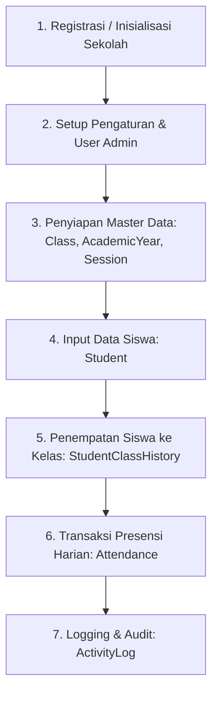

# Dokumentasi Entitas, Relasi (ERD), dan Perjalanan Data

Dokumen ini berisi rangkuman arsitektur data, relasi antar entitas, serta alur (flow) perjalanan data pada backend presensi.

---

## 1. Daftar Entitas & Perannya

| Entitas | File Model | Deskripsi & Peran |
| :--- | :--- | :--- |
| **`School`** | [`school.entity.ts`](file:///d:/kuz/presence-backend/src/schools/entities/school.entity.ts) | **Tenant Utama (Multitenancy)**. Semua data master (User, Student, Class, AcademicYear, Session, Setting) terikat ke `School`. |
| **`Role`** | [`role.entity.ts`](file:///d:/kuz/presence-backend/src/roles/entities/role.entity.ts) | Definisi peran hak akses pengguna (misal: Admin, Guru, Staff). |
| **`User`** | [`user.entity.ts`](file:///d:/kuz/presence-backend/src/users/entities/user.entity.ts) | Akun Pengguna / Pengelola sistem yang terhubung ke `Role` dan `School`. |
| **`Student`** | [`student.entity.ts`](file:///d:/kuz/presence-backend/src/students/entities/student.entity.ts) | Master Data Siswa (NISN, Nama Lengkap, Gender, Email, Password) terikat ke `School`. |
| **`Class`** | [`class.entity.ts`](file:///d:/kuz/presence-backend/src/classes/entities/class.entity.ts) | Master Data Kelas (misal: "X IPA 1") di bawah `School`. |
| **`AcademicYear`** | [`academic-year.entity.ts`](file:///d:/kuz/presence-backend/src/academic-years/entities/academic-year.entity.ts) | Master Tahun Ajaran (misal: `2024/2025`) dengan tanggal mulai/selesai & status aktif. |
| **`StudentClassHistory`** | [`student-class-history.entity.ts`](file:///d:/kuz/presence-backend/src/student-class-histories/entities/student-class-history.entity.ts) | **Pivot/Junction Table**. Menghubungkan `Student` + `Class` + `AcademicYear` + `School`. Melacak riwayat penempatan kelas siswa per tahun ajaran. |
| **`AttendanceSession`** | [`attendance-session.entity.ts`](file:///d:/kuz/presence-backend/src/attendance-sessions/entities/attendance-session.entity.ts) | Master Sesi Presensi (misal: Sesi Masuk Pagi, Sesi Pulang) beserta rentang `start_time` & `end_time`. |
| **`Attendance`** | [`attendance.entity.ts`](file:///d:/kuz/presence-backend/src/attendances/entities/attendance.entity.ts) | **Data Transaksi Presensi**. Terikat ke `StudentClassHistory` (bukan langsung `Student` saja) dan `AttendanceSession`. |
| **`Setting`** | [`setting.entity.ts`](file:///d:/kuz/presence-backend/src/settings/entities/setting.entity.ts) | Pengaturan default aplikasi & default jam masuk/keluar per `School`. |
| **`ActivityLog`** | [`activity-logs.entity.ts`](file:///d:/kuz/presence-backend/src/activity-logs/entities/activity-logs.entity.ts) | Audit Log aktivitas pengguna (`User` atau `Student`) seperti login, ubah data, atau pencatatan presensi. |

---

## 2. Diagram Relasi Entitas (ERD)

```mermaid
erDiagram
    School ||--o{ User : "memiliki"
    School ||--o{ Student : "memiliki"
    School ||--o{ Class : "memiliki"
    School ||--o{ AcademicYear : "memiliki"
    School ||--o{ Setting : "memiliki"
    School ||--o{ AttendanceSession : "memiliki"
    School ||--o{ StudentClassHistory : "memiliki"

    Role ||--o{ User : "diberikan ke"

    Student ||--o{ StudentClassHistory : "terdaftar dalam"
    Class ||--o{ StudentClassHistory : "diisi oleh"
    AcademicYear ||--o{ StudentClassHistory : "berlaku untuk"

    StudentClassHistory ||--o{ Attendance : "memiliki catatan presensi"
    AttendanceSession ||--o{ Attendance : "sesi presensi"

    User ||--o{ ActivityLog : "melakukan aksi"
    Student ||--o{ ActivityLog : "melakukan aksi"
```

---

## 3. Alur Perjalanan Data (Data Journey)



### Penjelasan Detil Tahapan Flow

1. **Inisialisasi Master Sekolah (`School`)**
   - Sekolah didaftarkan sebagai induk organisasi.
2. **Setup Pengguna & Pengaturan (`User`, `Role`, `Setting`)**
   - Dibuat akun admin/pengelola yang terhubung ke `Role` dan `School`.
   - Pengaturan jam masuk & keluar default disimpan pada `Setting`.
3. **Konfigurasi Akademik & Sesi Presensi (`Class`, `AcademicYear`, `AttendanceSession`)**
   - Admin mendefinisikan master kelas (misal: "X IPA 1").
   - Admin menentukan tahun ajaran aktif (misal: `2024/2025`).
   - Admin membuat sesi-sesi presensi (misal: "Presensi Pagi" `06:30 - 07:30`).
4. **Pendaftaran Siswa & Plotting Kelas (`Student` & `StudentClassHistory`)**
   - Data siswa diinput ke `Student`.
   - Siswa dihubungkan ke `Class` dan `AcademicYear` melalui `StudentClassHistory` (dengan atribut `is_active = true`).
5. **Pencatatan Presensi Harian (`Attendance`)**
   - Saat proses check-in / check-out dilakukan:
     - Sistem mengambil riwayat kelas aktif siswa (`student_class_history_id`).
     - Presensi dicatat pada entitas `Attendance` bersama waktu `check_in`, `check_out`, tanggal `attendance_date`, sesi `attendance_session_id`, serta status (`PRESENT`, `LATE`, `PERMIT`, `SICK`, `ABSENT`).
6. **Logging & Monitoring (`ActivityLog`)**
   - Setiap transaksi atau perubahan data penting yang dipicu oleh `User` atau `Student` disimpan dalam `ActivityLog` lengkap dengan `ip_address`, `device`, dan `metadata`.
